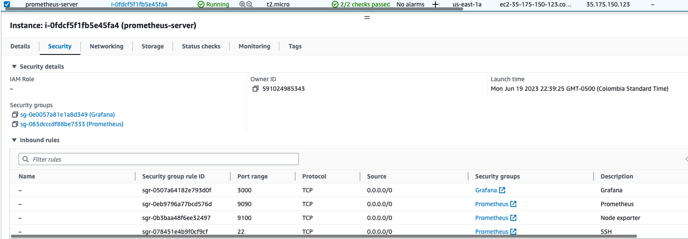
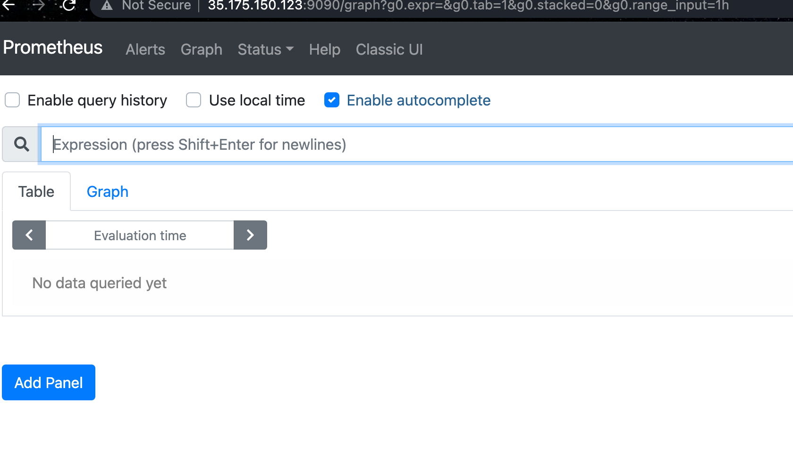
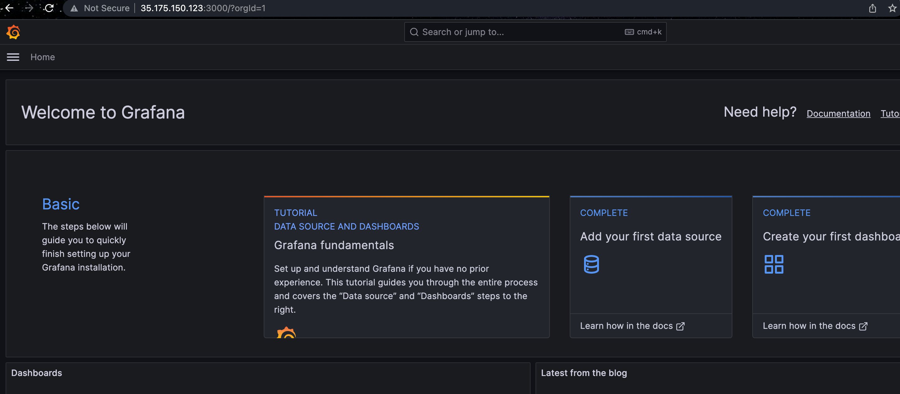
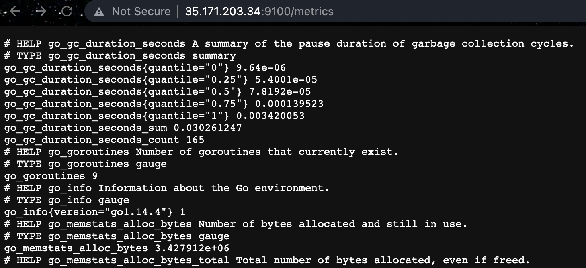
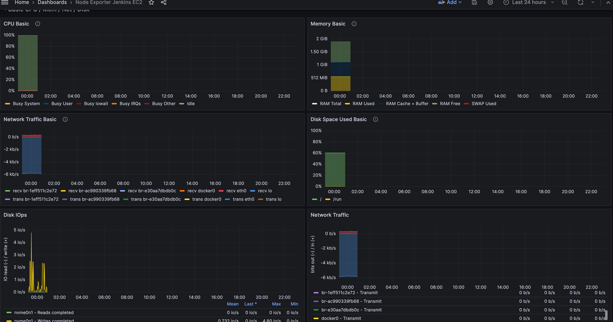

# my-simple-webapp Runbook
Personal DevOps project with web app in flask, Docker, Terraform, AWS, Ansible and Jenkins.
CI/CD using Jenkins pipeline to:
- Build a docker image and push it to the hub.
- Run the container based on the previous image (a Flask web application in port 5000).
- Provision with terraform all the AWS resources needed for the app and the Ansible inventory. (A delete option is also provided when running the job manually in Jenkins).
- Provision all packages and run required processes to start app in the host using Ansible.

All this, every time someone makes a commit or a PR to branch main.

 
## Web app & docker
Web app designed with Flask where the user search for the name of a planet of the solar system and the app will retrieve all the info of the planet comming from the [API](https://api.le-systeme-solaire.net/swagger/)
- Exposes through port 5000.
- to execute container locally run: 
    ```sh
    docker run -d -p 5000:5000 sdupegui/planet-app:1.3
    ```
    
## Jenkins
Jenkins exposed in port 8080 by default. Create a pipeline job and in there select: 
- Select choice parameters
- Github integrations: Pipeline script from SCM and Github hook trigger.
- Set the credentials for docker hub login
- Set the credential to clone github repository (if it's private).
- Set AWS credentials so Terraform can provision/delete resources and manage the backend.
- Install suggested plugins and: 
  - CloudBees Docker Build and Publish plugin
  - Docker Pipeline
  - Ansible plugin
  - Terraform plugin


## Github
Create a Github webhook and in the URL set the URL of: https//:Public-DNS/Jenkins-port/github-webhook/

## Terraform
Used to declare the infrastructure as a code of the AWS resources used for the application:
- Create ssh private key and public key for EC2 (The same used later for Ansible when running the playbook)
- Amazon Linux EC2 instance where flask will be running the app.
- Security group.
- To create the infrastructure manually run the following command in terraform folder:
    ```sh
    terraform init
    terraform plan
    terraform apply
    terraform destroy # To destroy all
    terraform destroy --target=aws_instance.ec2-webapp # To destroy only the ec2 (app)
    ```

## Ansible
Used to provision the packages that we need for run our application in remote hosts.
- Inventory: Put there the user@public-ip of your host.
- playbook-provision.yml: Tasks to install the packages required for the app in all the hosts.
- To manually execute the playbook run in the ansible folder:
   ```sh
    sudo ansible-playbook --key-file ~/PATH-TO-KEY.pem -i inventory --ask-become-pass playbook.yml       
   ```

## Monitoring: 
Prometheus and Grafana
- Create new EC2 instance for prometheus and grafana service.
    - Install Prometheus and Grafana.
    - Attach security groups with inbound rules (SSH, TCP 3000, 9090 and 9100):
    
    - Verify connection with <'public-IP'>:9090 (Prometheus)
    
    - Verify connection with <'public-IP'>:3000 (Grafana)
    
    - Edit prometheus.yml file and put in targets the public IP of Jenkins EC2 instance like this <'public-IP'>:9100:
          ```YAML
            global:
              scrape_interval: 15s
              external_labels:
                monitor: 'prometheus'

            scrape_configs:
              - job_name: 'prometheus'
                static_configs:
                  - targets: ['xx.xx.xx.xx:9100']
          ```
- In Jenkins EC2 instance, download [node exporter](https://prometheus.io/docs/guides/node-exporter/) from Prometheus documentation for monitoring Linux instances:
    - Add Prometheus SG to Jenkins SG in AWS.
    - Validate metrics, by going to <'public-IP'>:9100/metrics (Prometheus node exporter):
    
- Link metrics with Grafana's dashboard:
    - Go to Data sources in grafana and select prometheus, then, put there the URL of the server, the press save and test:
    
    - Go to explore, then select prometheus and you can start exploring all metrics from node:
    
    - You can create a dashboard with variables to monitor:
     